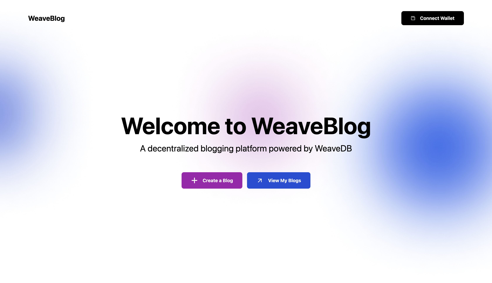

# Weaveblog



Weaveblog is a decentralized blogging platform that allows users to create, edit, and delete blog posts. Built with modern web technologies and integrated with blockchain capabilities, Weaveblog offers a secure and user-friendly experience for bloggers.

## Features

- Create new blog posts
- Edit existing blog posts
- Delete blog posts
- View a list of all blogs
- View individual blog details
- User authentication with wallet integration

## Tech Stack

- Frontend: React.js with Next.js framework
- Styling: TailwindCSS
- State Management: React Context API
- Image Upload: Opted for Cloudinary to provide a gasless transaction
- Data Storage: WeaveDB

## Project Structure

```md
WEAVEBLOG
├── components
│   ├── BlogCard.jsx
│   ├── BlogDetailsModal.jsx
│   ├── BlogList.jsx
│   ├── CreateBlogForm.jsx
│   ├── FileUpload.jsx
│   ├── Layout.jsx
│   └── NavBar.jsx
├── context
│   ├── walletContext.js
│   ├── walletProvider.js
│   └── walletProvider.jsx
├── hooks
│   └── useWallet.js
├── pages
│   ├── api
│   ├── blogs
│   │   ├── [id].jsx
│   │   └── create.jsx
│   ├── _app.js
│   ├── _document.js
│   ├── index.jsx
│   └── my-blogs.jsx
├── public
│   ├── bg.png
│   ├── favicon.ico
│   ├── next.svg
│   └── vercel.svg
├── styles
│   └── globals.css
└── utils
    ├── classnames.js
    ├── cloudinary.js
    ├── constants.js
    └── uploadImage.js
```

## Setup and Installation

1. Clone the repository:

   ```bash
   git clone https://github.com/codewithmide/weaveblog.git
   cd weaveblog
   ```

2. Install dependencies:

   ```bash
   npm install
   ```

3. Set up environment variables:
   Create a `.env` file in the root directory and add necessary environment variables (e.g., Cloudinary credentials).

4. Run the development server:

   ```bash
   npm run dev
   ```

5. Open `http://localhost:3000` in your browser to view the application.

## Usage

1. Connect your wallet to authenticate.
2. Navigate to the "Create Blog" page to write a new blog post.
3. View all blogs on the home page or "My Blogs" for your own posts.
4. Click on a blog card to view details, edit, or delete the post.

## Contributing

Contributions are welcome! Please feel free to submit a Pull Request.
